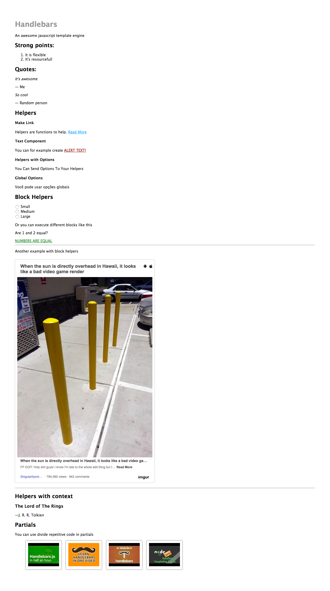

# Handlebars Tutorial
This repository is a single page, using **node.js** as the server with **express.js**, **handlebars** as the template language and **sass**.

The page shows **Handlebar's** features as you follow the headers.

### The video

### How to run
* `npm install`
* `npm start`

Thank you <a href="https://www.youtube.com/derekbanas">Derek Banas</a> for awesome tutorials.

## The page

    

